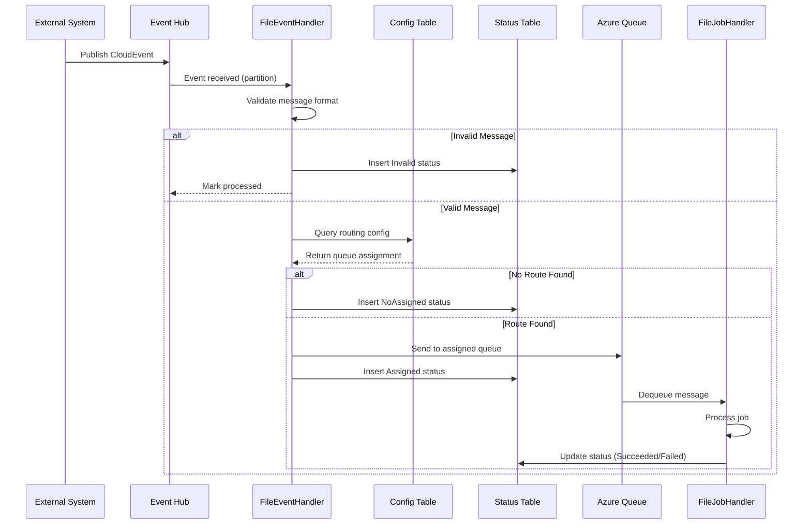

# Event-Driven Architecture

The FTS platform uses an event-driven architecture with Azure Event Hub as the central message broker and CloudEvents as the standard message format.

## CloudEvents Standard

FTS uses the [CloudEvents specification](https://cloudevents.io/) (v1.0) for all event messages. This ensures interoperability and consistent message handling across the platform.

### Event Structure

```json
{
  "specversion": "1.0",
  "type": "Succeeded",
  "source": "FTP.File.ExternalService",
  "subject": "File Upload",
  "id": "unique-event-id",
  "time": "2024-01-15T10:30:00+0000",
  "dataschema": "1.0",
  "data": {
    "correlationId": "correlation-123",
    "instanceId": "instance-456",
    "clientIpAddress": "10.0.0.1",
    "accountId": "ACCOUNT001",
    "fileName": "data/incoming/file.csv",
    "targetFileName": "processed/file.csv",
    "fileSize": 1024,
    "sourceFileName": "original.csv",
    "parameters": ["param1", "param2"]
  }
}
```

### Event Fields

| Field | Type | Required | Description |
|-------|------|----------|-------------|
| `specversion` | string | Yes | CloudEvents spec version (always "1.0") |
| `type` | string | Yes | Event type (e.g., "Succeeded", "Error") |
| `source` | string | Yes | Event source identifier |
| `subject` | string | Yes | Event subject/category |
| `id` | string | Yes | Unique event identifier |
| `time` | string | Yes | ISO 8601 timestamp |
| `dataschema` | string | No | Data schema version |
| `data` | object | Yes | Event payload |

### Data Payload Fields

| Field | Type | Description |
|-------|------|-------------|
| `correlationId` | string | Correlation ID for tracing |
| `instanceId` | string | Processing instance identifier |
| `clientIpAddress` | string | Client IP address |
| `accountId` | string | Account identifier for routing |
| `fileName` | string | Source file path |
| `targetFileName` | string | Destination file path |
| `fileSize` | long | File size in bytes |
| `sourceFileName` | string | Original source filename |
| `parameters` | string[] | Additional parameters |

## Event Processing Sequence



## Event Hub Configuration

### Consumer Group
FileEventHandler uses a dedicated consumer group for reliable message processing.

### Partition Processing
- Events are distributed across partitions based on partition key
- Each partition is processed by a single consumer instance
- Offset tracking ensures exactly-once processing

### Connection Configuration (from appsettings)
```json
{
  "EventHub": {
    "EnterpriseFTP": {
      "ConnectionString": "Endpoint=sb://...",
      "EventHubName": "enterprise-{env}-ftp-ehb"
    }
  }
}
```

## Event Types

### Inbound Events
Events triggering file transfer jobs:

| Type | Source | Subject | Description |
|------|--------|---------|-------------|
| `Succeeded` | `FTP.File.ExternalService` | `File Upload` | File uploaded to SFTP |
| `Succeeded` | `BlobStore` | `File Upload` | File uploaded to Blob |
| `Scheduled` | `Scheduler` | `Batch Process` | Scheduled batch trigger |

### Outbound Events (FireEvent Action)
Events generated by job completion:

| Type | Source | Subject | Description |
|------|--------|---------|-------------|
| `Succeeded` | Configurable | Configurable | Job completed successfully |
| `Error` | Configurable | Configurable | Job failed |

## Message Validation

FileEventHandler validates all incoming messages:

1. **JSON Format**: Message must be valid JSON
2. **Required Fields**: `type`, `source`, `subject`, `data.accountId` must be present
3. **Non-Empty Values**: Required fields cannot be empty strings

### Validation Flow
```csharp
// From MessageHandler.cs
if (string.IsNullOrEmpty(Notify.type) ||
    string.IsNullOrEmpty(Notify.subject) ||
    string.IsNullOrEmpty(Notify.source) ||
    string.IsNullOrEmpty(Notify.data.accountId))
{
    // Mark as garbage message
    return null;
}
```

## Error Handling

### Invalid Messages
- Logged with full message content
- Recorded in `jobstatus` table with `Invalid` status
- Include `InvalidReason` for debugging

### Processing Failures
- Retry with exponential backoff (configurable)
- After max retries, marked as `Failed`
- Detailed error in `Message` field

## Event Chaining

Jobs can fire new events upon completion using the `FireEvent` action:

```json
{
  "type": "FireEvent",
  "eventType": "FileProcessed",
  "eventSource": "FTS.JobHandler",
  "eventSubject": "File Ready",
  "eventAccountId": "ACCOUNT001",
  "eventFileName": "{@Message.fileName}"
}
```

This enables:
- Multi-stage processing pipelines
- Notification to downstream systems
- Event-driven workflows

## Monitoring Events

### Datadog Integration
All event processing is traced via Datadog APM:
- Event receipt timestamp
- Processing duration
- Success/failure status
- Correlation IDs for tracing

### Logging
NLog captures:
- Full event payload (debug level)
- Routing decisions
- Error details

## Related Documentation

- [Queue Architecture](./queue-architecture.md)
- [Notification Model](../data-models/notification-model.md)
- [Action Types - FireEvent](../job-configuration/action-types.md#fireevent)
