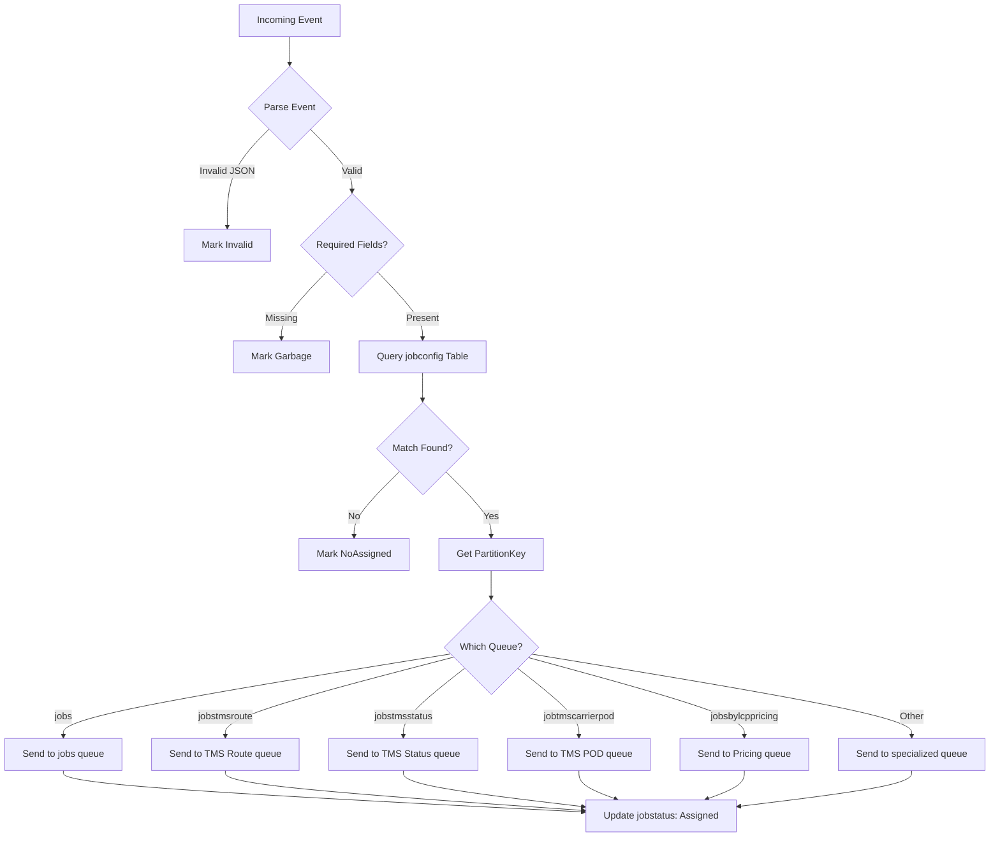
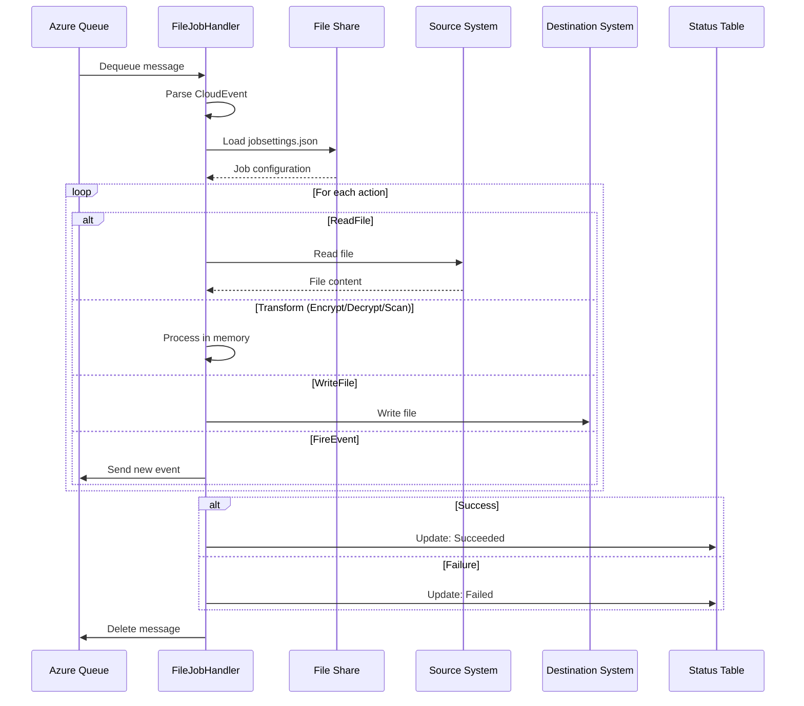

# Queue Architecture

The FTS platform uses Azure Queue Storage to distribute jobs to specialized handlers. A routing table determines which queue receives each event based on event attributes.

## Queue Topology

```
Azure Event Hub
       │
       ▼
FileEventHandler ──────────────────────────────────────────────────┐
       │                                                            │
       ├── Query jobconfig table                                   │
       │                                                            │
       ▼                                                            ▼
┌─────────────────────────────────────────────────────────────────────┐
│                        Azure Queue Storage                          │
├─────────────────┬─────────────────┬─────────────────┬──────────────┤
│ jobs            │ jobstmsroute    │ jobstmsstatus   │ ...more      │
│ (generic)       │ (TMS Route)     │ (TMS Status)    │              │
└────────┬────────┴────────┬────────┴────────┬────────┴──────────────┘
         │                 │                 │
         ▼                 ▼                 ▼
   FileJobHandler   FileJobHandler   FileJobHandler
                      -TMSRoute        -TMSStatus
```

## Routing Configuration Table (jobconfig)

The `jobconfig` Azure Table stores routing rules that map events to queues.

### Table Schema

| Property | Type | Description |
|----------|------|-------------|
| `PartitionKey` | string | Queue assignment identifier |
| `RowKey` | string | Unique rule identifier |
| `EventType` | string | Event type to match |
| `EventSource` | string | Event source to match |
| `EventSubject` | string | Event subject to match |
| `EventAccountID` | string | Account ID to match |

### Routing Decision Flow



### Routing Lookup

The routing lookup matches on four attributes (from `MessageHandler.cs`):
```csharp
PartitionKey = _tableHelper.SearchConfigTable(
    Notify.data.accountId,  // EventAccountID
    Notify.source,          // EventSource
    Notify.type,            // EventType
    Notify.subject,         // EventSubject
    OriginalOffsetId
);
```

### Example Routing Rules

| PartitionKey | EventType | EventSource | EventSubject | EventAccountID |
|--------------|-----------|-------------|--------------|----------------|
| jobs | Succeeded | FTP.File.ExternalService | File Upload | ACCOUNT001 |
| jobstmsroute | Succeeded | TMS.Route | File Upload | TMS001 |
| jobstmsstatus | Succeeded | TMS.Status | Status Update | TMS001 |
| jobsbylcppricing | Succeeded | Pricing.LCP | Price Update | PRICING001 |

## Queue Names

The system supports multiple specialized queues:

| Queue Name | Handler | Description |
|------------|---------|-------------|
| `jobs` | FileJobHandler | Generic file transfer jobs |
| `jobstmsroute` | FileJobHandler-TMSRoute | TMS routing files |
| `jobstmsstatus` | FileJobHandler-TMSStatus | TMS status files |
| `jobtmscarrierpod` | FileJobHandler-TMSCarrierPOD | Carrier POD files |
| `jobsbylcppricing` | FileJobHandler-PriceProposal | LCP pricing files |
| `jobsbellusermanagement` | FileJobHandler | Bell user management |
| `jobsbellsrs` | FileJobHandler | Bell SRS files |
| `jobsbellpricegrid` | FileJobHandler | Bell price grid |
| `jobscalgary` | FileJobHandler | Calgary operations |
| `jobsdigitalml` | FileJobHandler | Digital ML files |
| `jobspunchcard` | FileJobHandler | Punchcard processing |
| `jobtmsrateshop` | FileJobHandler | TMS rate shop |
| `jobspostalmate` | FileJobHandler | Postalmate integration |
| `jobhrvariancereport` | FileJobHandler | HR variance reports |
| `jobmonerisupdater` | FileJobHandler | Moneris updates |
| `jobstatfloklaviyo` | FileJobHandler | Statflo/Klaviyo |
| `jobamazontax` | FileJobHandler | Amazon tax files |
| `jobamzskulist` | FileJobHandler | Amazon SKU lists |

## Job Processing Sequence



## Queue Configuration

### appsettings.json
```json
{
  "Queues": {
    "jobs": {
      "Url": "https://{storage}.queue.core.windows.net/jobs",
      "SASToken": "sv=2018-03-28&si=..."
    },
    "NextCheck": 1000,
    "NextWriteForLogs": 60,
    "VisibilityTimeout": 120
  }
}
```

### Configuration Properties

| Property | Type | Description |
|----------|------|-------------|
| `Url` | string | Queue endpoint URL |
| `SASToken` | string | SAS token for authentication |
| `NextCheck` | int | Polling interval in milliseconds |
| `NextWriteForLogs` | int | Log write interval in seconds |
| `VisibilityTimeout` | int | Message invisibility timeout (minutes) |

## Message Visibility

When a handler dequeues a message:
1. Message becomes invisible for `VisibilityTimeout` minutes
2. Handler processes the job
3. On success: Handler deletes the message
4. On failure: Message becomes visible again for retry
5. After max retries: Message moves to poison queue

## Error Handling

### Retry Configuration
```json
{
  "Actions": {
    "RetryFailureSource": 3,
    "RetryFailureDestination": 3,
    "RetryFailureSourceDelay": 5,
    "RetryFailureDestinationDelay": 5
  }
}
```

### Retry Behavior
- Source operations retry `RetryFailureSource` times
- Destination operations retry `RetryFailureDestination` times
- Delay between retries (seconds) is configurable
- Exponential backoff not implemented (linear retry)

## JobStatus Table

All job processing states are recorded in the `jobstatus` Azure Table.

### Status Values

| Status | Description |
|--------|-------------|
| `Invalid` | Message validation failed |
| `ReadMessage` | Message being processed |
| `Assigned` | Routed to queue |
| `NoAssigned` | No routing rule matched |
| `Succeeded` | Job completed successfully |
| `Failed` | Job execution failed |

See [JobStatus Model](../data-models/jobstatus-model.md) for full schema.

## Scaling Considerations

### Queue Partitioning
- Separate queues prevent workload contention
- Specialized handlers can scale independently
- High-volume accounts can have dedicated queues

### Handler Scaling
- Kubernetes HPA for pod scaling
- Multiple replicas compete for queue messages
- Message locking prevents duplicate processing

## Related Documentation

- [Event-Driven Architecture](./event-driven-architecture.md)
- [JobStatus Model](../data-models/jobstatus-model.md)
- [Routing ConfigModel](../data-models/routing-config-model.md)
