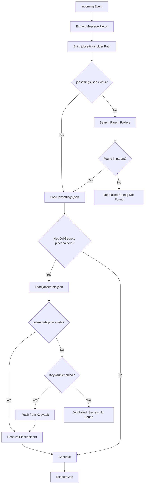

# Jobsettings Storage

This document describes how job configuration files are stored, located, and resolved at runtime.

## Storage Location

Job configurations are stored on an Azure File Share mounted at:
```
/mnt/jobconfig/{source}/{accountID}/{fileName.subFolder}/
```

### Directory Components

| Component | Source | Example |
|-----------|--------|---------|
| `/mnt/jobconfig` | Fixed mount point | |
| `{source}` | `{@Message.source}` from event | `FTP.File.ExternalService` |
| `{accountID}` | `{@Message.accountID}` from event | `ACCOUNT001` |
| `{fileName.subFolder}` | Derived from `{@Message.fileName}` | `incoming` |

### Example Paths

For event:
```json
{
  "source": "FTP.File.ExternalService",
  "data": {
    "accountId": "VENDOR001",
    "fileName": "incoming/reports/daily.csv"
  }
}
```

Configuration path:
```
/mnt/jobconfig/FTP.File.ExternalService/VENDOR001/incoming/reports/
├── jobsettings.json
└── jobsecrets.json
```

## File Structure

### jobsettings.json

Main job configuration file containing:
- Source server configuration
- Destination server configurations
- Action sequence

See [Job ConfigModel](../data-models/job-config-model.md) for schema.

### jobsecrets.json

Sensitive credentials stored separately:

```json
{
  "vendorUser": "actual-username",
  "vendorPass": "actual-password",
  "pgpPassword": "key-passphrase",
  "blobConnection": "DefaultEndpointsProtocol=https;..."
}
```

### Key Files

Encryption keys stored in same directory:

```
/mnt/jobconfig/FTP.File.ExternalService/VENDOR001/incoming/
├── jobsettings.json
├── jobsecrets.json
├── private.key          # PGP private key
├── public.key           # PGP public key
└── id_rsa               # SSH private key
```

## Configuration Resolution Flow



## Folder Search Behavior

If `jobsettings.json` is not found in the expected path, the system searches parent folders upward.

### Search Example

For path `/mnt/jobconfig/FTP.File.ExternalService/VENDOR001/data/reports/`:

1. Check: `/mnt/jobconfig/FTP.File.ExternalService/VENDOR001/data/reports/jobsettings.json`
2. Check: `/mnt/jobconfig/FTP.File.ExternalService/VENDOR001/data/jobsettings.json`
3. Check: `/mnt/jobconfig/FTP.File.ExternalService/VENDOR001/jobsettings.json`
4. Stop at account root

### Use Case

A single configuration can handle multiple subfolders:

```
/mnt/jobconfig/source/ACCOUNT001/
├── jobsettings.json       # Handles all subfolders
├── jobsecrets.json
├── incoming/
│   ├── data/              # Uses parent jobsettings.json
│   └── reports/           # Uses parent jobsettings.json
└── archive/               # Uses parent jobsettings.json
```

## JobSecrets Resolution

### Placeholder Pattern

```
{@JobSecrets.([a-zA-Z0-9]*)}
```

### Resolution Process

1. **File-based** (Primary):
   - Load `jobsecrets.json` from same folder as `jobsettings.json`
   - Match placeholder key to JSON property

2. **KeyVault-based** (Fallback):
   - If file not found and KeyVault enabled
   - Fetch secret from Azure Key Vault
   - Secret name derived from placeholder key

### Configuration (appsettings.json)

```json
{
  "KeyVaultSecrets": {
    "Enable": true,
    "Uri": "https://fts-{env}-key-vault.vault.azure.net/",
    "TanentID": "tenant-guid"
  }
}
```

## Path Placeholder Resolution

The `jobsettingsfolder` path is built from message fields:

### appsettings.json

```json
{
  "AzureFiles": {
    "jobsettingsfolder": "/mnt/jobconfig/{@Message.source}/{@Message.accountID}/{@Message.fileName.subFolder}",
    "jobsettingsfile": "{@AppSettings.jobsettingsfolder}/jobsettings.json",
    "jobsecretsfile": "{@AppSettings.jobsettingsfolder}/jobsecrets.json"
  }
}
```

### Resolution Example

Event:
```json
{
  "source": "TMS.Route",
  "data": {
    "accountId": "TRANSPORT001",
    "fileName": "routes/daily/route_file.xml"
  }
}
```

Resolution:
1. `{@Message.source}` → `TMS.Route`
2. `{@Message.accountID}` → `TRANSPORT001`
3. `{@Message.fileName.subFolder}` → `routes/daily`
4. Result: `/mnt/jobconfig/TMS.Route/TRANSPORT001/routes/daily/`

## Directory Organization Patterns

### Per-Feed Pattern

Each data feed has its own configuration:

```
/mnt/jobconfig/
├── FTP.File.ExternalService/
│   ├── VENDOR001/
│   │   ├── invoices/
│   │   │   ├── jobsettings.json
│   │   │   └── jobsecrets.json
│   │   └── orders/
│   │       ├── jobsettings.json
│   │       └── jobsecrets.json
│   └── VENDOR002/
│       └── ...
└── TMS.Route/
    └── TRANSPORT001/
        └── ...
```

### Shared Configuration Pattern

Account shares configuration across subfolders:

```
/mnt/jobconfig/FTP.File.ExternalService/VENDOR001/
├── jobsettings.json         # Shared by all subfolders
├── jobsecrets.json
├── private.key
├── invoices/                # Uses parent config
├── orders/                  # Uses parent config
└── reports/                 # Uses parent config
```

### Environment-Specific Keys

Different keys per subfolder:

```
/mnt/jobconfig/FTP.File.ExternalService/VENDOR001/
├── jobsettings.json         # Shared config
├── jobsecrets.json          # Shared secrets
├── incoming/
│   ├── decrypt_private.key  # Decrypt key for incoming
│   └── ...
└── outgoing/
    ├── encrypt_public.key   # Encrypt key for outgoing
    └── ...
```

## Troubleshooting

### Config Not Found

**Error**: `Could not find jobsettings.json`

**Causes**:
1. Event source doesn't match folder structure
2. Account ID mismatch
3. Subfolder path extraction issue

**Resolution**:
1. Verify event fields: `source`, `accountId`, `fileName`
2. Check folder exists at expected path
3. Ensure file permissions allow read access

### Secrets Not Resolved

**Error**: Placeholder appears in credentials

**Causes**:
1. `jobsecrets.json` missing
2. Key not in secrets file
3. KeyVault not configured/accessible

**Resolution**:
1. Verify `jobsecrets.json` exists alongside `jobsettings.json`
2. Check key name matches placeholder exactly
3. Verify KeyVault configuration and access

### Key File Not Found

**Error**: `Key/Vault Private key not found`

**Causes**:
1. Key file path incorrect
2. File doesn't exist at path
3. File permissions issue

**Resolution**:
1. Use `{@AppSettings.jobsettingsfolder}` for relative paths
2. Verify file exists in configuration folder
3. Check file permissions

## Best Practices

1. **Organize by Account**: Keep all account configurations together
2. **Use Shared Configs**: Share common configurations via parent folders
3. **Separate Secrets**: Always use `jobsecrets.json` for credentials
4. **Version Control**: Track configuration changes outside of Azure Files
5. **Naming Convention**: Use descriptive folder names matching event sources

## Related Documentation

- [Job ConfigModel](../data-models/job-config-model.md)
- [Placeholders Reference](./placeholders-reference.md)
- [Security & Secrets](../operations/security-secrets.md)
