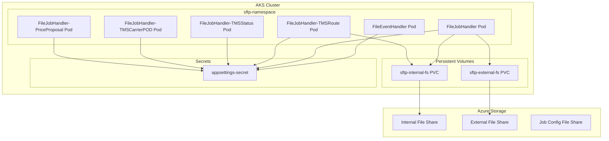

# Deployment Architecture

FTS components are deployed as containerized microservices on Azure Kubernetes Service (AKS) using Azure DevOps Pipelines for CI/CD.

## Kubernetes Architecture



## Namespace Configuration

| Environment | Namespace | Description |
|-------------|-----------|-------------|
| Development | `sftp-dev` | Development testing |
| Staging | `sftp-stg` | Pre-production validation |
| Production | `sftp-prod` | Production workloads |

## Pod Configuration

### Deployment Template (file-job-handler-template.yaml)

```yaml
apiVersion: apps/v1
kind: Deployment
metadata:
  name: ${K8S_APP_NAME}
  namespace: ${K8S_PROJECT}-${K8S_ENV}
  labels:
    app: ${K8S_APP_NAME}
    project: ${K8S_PROJECT}
    env: ${K8S_ENV}
    version: ${K8S_VERSION}
spec:
  replicas: ${K8S_APP_REPLICAS}
  selector:
    matchLabels:
      app: ${K8S_APP_NAME}
  template:
    metadata:
      labels:
        app: ${K8S_APP_NAME}
    spec:
      containers:
        - name: ${K8S_APP_NAME}
          image: ${K8S_IMAGE_URI}:${K8S_IMAGE_TAG}
          volumeMounts:
            - name: appsettings
              mountPath: /app/appsettings.Production.json
              subPath: appsettings.Production.json
            - name: sftpintroot
              mountPath: /mnt/sftpintroot
            - name: sftpextroot
              mountPath: /mnt/sftpextroot
      volumes:
        - name: appsettings
          secret:
            secretName: ${K8S_APP_SECRET}
        - name: sftpintroot
          persistentVolumeClaim:
            claimName: ${K8S_APP_INT_VOLUME_CLAIM}
        - name: sftpextroot
          persistentVolumeClaim:
            claimName: ${K8S_APP_EXT_VOLUME_CLAIM}
```

### Environment Variables

| Variable | Description | Example |
|----------|-------------|---------|
| `K8S_PROJECT` | Project identifier | `sftp` |
| `K8S_ENV` | Environment | `dev`, `stg`, `prod` |
| `K8S_VERSION` | Application version | `20240115.abc1234` |
| `K8S_APP_NAME` | Application name | `file-job-handler` |
| `K8S_APP_REPLICAS` | Pod replicas | `1` |
| `K8S_IMAGE_URI` | Container registry | `enterprisenonpacr.azurecr.io/enterprise/file-job-handler` |
| `K8S_IMAGE_TAG` | Image tag | `develop-abc1234` |

## Volume Mounts

| Mount Path | Purpose | PVC Name |
|------------|---------|----------|
| `/mnt/sftpintroot` | Internal SFTP files | `sftp-internal-fs-{env}` |
| `/mnt/sftpextroot` | External SFTP files | `sftp-external-fs-{env}` |
| `/mnt/jobconfig` | Job configuration files | (part of internal mount) |

## Secrets Management

Application settings are stored as Kubernetes secrets:

```bash
# Create secret from file
kubectl create secret -n sftp-dev generic \
  sftp-dev-file-job-handler-app-settings-secret \
  --from-file=./appsettings.Production.json
```

Secret names by environment:
- Dev: `sftp-dev-file-job-handler-app-settings-secret`
- Stg: `sftp-stg-file-job-handler-app-settings-secret`
- Prod: `sftp-prod-file-job-handler-app-settings-secret`

## CI/CD Pipeline

```mermaid
flowchart LR
    subgraph Build Stage
        A[Source Code] --> B[Restore Packages]
        B --> C[Run Tests]
        C --> D[Build Docker Image]
        D --> E[Push to ACR]
    end

    subgraph Dev Deployment
        E --> F[Extract Templates]
        F --> G[Configure appsettings]
        G --> H[Create K8s Secret]
        H --> I[Apply Deployment]
    end

    subgraph Stg Deployment
        I --> J[Configure appsettings]
        J --> K[Create K8s Secret]
        K --> L[Apply Deployment]
    end

    subgraph Prod Deployment
        L --> M[Tag Image for Prod ACR]
        M --> N[Push to Prod ACR]
        N --> O[Configure appsettings]
        O --> P[Create K8s Secret]
        P --> Q[Apply Deployment]
    end
```



### Pipeline Stages

| Stage | Trigger | Description |
|-------|---------|-------------|
| Test | All branches | Run unit tests |
| Build | `develop` branch | Build and push Docker image |
| DeployToDevEnv | After Build | Deploy to development |
| DeployToStgEnv | After Dev | Deploy to staging |
| DeployToProdEnv | After Stg | Deploy to production |

### Build Process

1. **Version Generation**:
   ```bash
   AppVersion="$(date +'%Y%m%d').$ShortVersion"
   ```

2. **Docker Build**:
   ```bash
   docker build \
     --build-arg ARG_APM_VENDOR=datadog \
     --build-arg ARG_BUILD_VERSION=${branch}-${version} \
     -t ${acrRepo}:${branch}-${version} \
     -f FileJobHandler/Dockerfile .
   ```

3. **Image Tagging**:
   - Dev/Stg: `enterprisenonpacr.azurecr.io/enterprise/file-job-handler:develop-abc1234`
   - Prod: `enterpriseprodacr.azurecr.io/enterprise/file-job-handler:develop-abc1234`

### Deployment Process

1. Extract template files from build artifacts
2. Substitute environment variables using `envsubst`
3. Delete existing secrets
4. Create new secrets from configured appsettings
5. Apply Kubernetes deployment

## Container Registry

| Environment | Registry | URL |
|-------------|----------|-----|
| Non-Production | enterprisenonpacr | `enterprisenonpacr.azurecr.io` |
| Production | enterpriseprodacr | `enterpriseprodacr.azurecr.io` |

## Agent Pools

| Pool | Environment | Use |
|------|-------------|-----|
| `ubuntu-latest` | Cloud | Build, test, image operations |
| `enterprise-nonp-aks-agents` | Non-Prod | Dev/Stg deployments |
| `enterprise-prod-aks-agents` | Prod | Production deployments |

## Health Monitoring

### Datadog Integration
- APM tracing enabled via `ARG_APM_VENDOR=datadog`
- Traces all service calls
- Custom metrics for job processing

### Application Logs
- NLog configured for structured logging
- Logs shipped to Datadog
- Log levels: Debug, Info, Warning, Error

## Scaling Configuration

### Horizontal Pod Autoscaler (HPA)
```yaml
apiVersion: autoscaling/v2
kind: HorizontalPodAutoscaler
metadata:
  name: file-job-handler-hpa
spec:
  scaleTargetRef:
    apiVersion: apps/v1
    kind: Deployment
    name: file-job-handler
  minReplicas: 1
  maxReplicas: 5
  metrics:
    - type: Resource
      resource:
        name: cpu
        target:
          type: Utilization
          averageUtilization: 70
```

### Resource Limits
```yaml
resources:
  requests:
    memory: "256Mi"
    cpu: "250m"
  limits:
    memory: "1Gi"
    cpu: "1000m"
```

## Related Documentation

- [Configuration Management](../operations/configuration-management.md)
- [Monitoring & Logging](../operations/monitoring-logging.md)
- [Security & Secrets](../operations/security-secrets.md)
