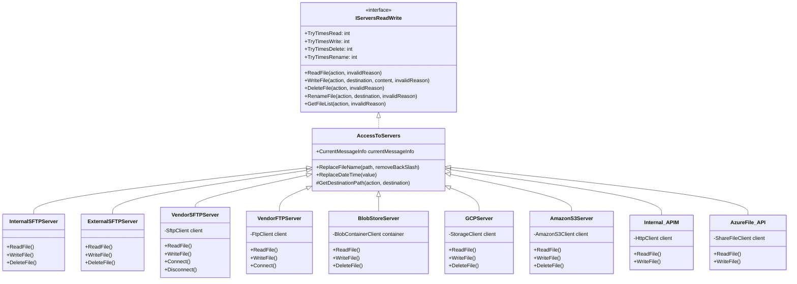

# Multi-Cloud Storage Architecture

FTS supports file transfers across multiple cloud providers and protocols. This document describes the storage integration architecture.

## Supported Storage Types

| Type Value | Description | Protocol |
|------------|-------------|----------|
| `Internal-SFTP` | Internal SFTP server (Azure File Share mounted) | SFTP |
| `External-SFTP` | External SFTP server (Azure File Share mounted) | SFTP |
| `Vendor-SFTP` | Third-party vendor SFTP servers | SFTP |
| `Vendor-FTP` | Third-party vendor FTP/FTPS servers | FTP/FTPS |
| `BlobStore` | Azure Blob Storage | Azure SDK |
| `GCP` | Google Cloud Storage | GCP SDK |
| `AmazonS3` | Amazon S3 | AWS SDK |
| `Internal-APIM` | Azure API Management | HTTPS |
| `AzureFile-API` | Azure File Share via API | Azure SDK |

## Server Class Hierarchy



## Azure Blob Storage (BlobStore)

### Configuration
```json
{
  "source": {
    "type": "BlobStore",
    "endpoint": "https://{account}.blob.core.windows.net",
    "credentials": {
      "containerName": "files",
      "connectionString": "{@JobSecrets.blobConnection}"
    }
  }
}
```

### Features
- SAS token or connection string authentication
- Container-level access
- Path-based file organization
- Supports large file transfers

### Required Fields
| Field | Description |
|-------|-------------|
| `endpoint` | Blob storage endpoint URL |
| `credentials.containerName` | Container name |
| `credentials.connectionString` | Connection string or SAS token |

## Google Cloud Storage (GCP)

### Configuration
```json
{
  "source": {
    "type": "GCP",
    "bucketName": "my-bucket",
    "servicetype": "service_account",
    "projectID": "my-project",
    "privateKeyID": "{@JobSecrets.gcpKeyId}",
    "clientEmail": "service@project.iam.gserviceaccount.com",
    "clientID": "123456789",
    "authUri": "https://accounts.google.com/o/oauth2/auth",
    "tokenUri": "https://oauth2.googleapis.com/token",
    "authProvider": "https://www.googleapis.com/oauth2/v1/certs",
    "clientCertUrl": "https://www.googleapis.com/robot/v1/metadata/x509/...",
    "universeDomain": "googleapis.com",
    "credentials": {
      "privateKey": "{@JobSecrets.gcpPrivateKey}"
    }
  }
}
```

### Features
- Service account authentication
- Bucket-level access
- Full GCP credential chain support

### Required Fields
| Field | Description |
|-------|-------------|
| `bucketName` | GCS bucket name |
| `servicetype` | Authentication type |
| `projectID` | GCP project ID |
| `clientEmail` | Service account email |
| `credentials.privateKey` | Private key content |

## Amazon S3 (AmazonS3)

### Configuration
```json
{
  "source": {
    "type": "AmazonS3",
    "bucketName": "my-bucket",
    "region": "us-east-1",
    "credentials": {
      "accessKey": "{@JobSecrets.s3AccessKey}",
      "secretKey": "{@JobSecrets.s3SecretKey}"
    }
  }
}
```

### Features
- Access key / secret key authentication
- Region-specific endpoints
- Standard S3 operations

### Required Fields
| Field | Description |
|-------|-------------|
| `bucketName` | S3 bucket name |
| `region` | AWS region |
| `credentials.accessKey` | AWS access key |
| `credentials.secretKey` | AWS secret key |

## Vendor SFTP (Vendor-SFTP)

### Configuration with Password
```json
{
  "source": {
    "type": "Vendor-SFTP",
    "host": "sftp.vendor.com",
    "port": "22",
    "path": "/incoming",
    "credentials": {
      "type": "BasicAuth",
      "username": "{@JobSecrets.sftpUser}",
      "password": "{@JobSecrets.sftpPass}"
    }
  }
}
```

### Configuration with SSH Key
```json
{
  "source": {
    "type": "Vendor-SFTP",
    "host": "sftp.vendor.com",
    "port": "22",
    "path": "/incoming",
    "credentials": {
      "type": "SSHKey",
      "username": "{@JobSecrets.sftpUser}",
      "sshkey": "{@AppSettings.jobsettingsfolder}/id_rsa"
    }
  }
}
```

### Authentication Types
| Type | Description |
|------|-------------|
| `BasicAuth` | Username and password |
| `SSHKey` | Username and SSH private key |

### Required Fields
| Field | Description |
|-------|-------------|
| `host` | SFTP server hostname |
| `port` | Port number (default: 22) |
| `path` | Base path on server |
| `credentials.type` | `BasicAuth` or `SSHKey` |

## Vendor FTP (Vendor-FTP)

### Configuration
```json
{
  "source": {
    "type": "Vendor-FTP",
    "host": "ftp.vendor.com",
    "port": "21",
    "path": "/incoming",
    "ssl": true,
    "credentials": {
      "username": "{@JobSecrets.ftpUser}",
      "password": "{@JobSecrets.ftpPass}"
    }
  }
}
```

### Features
- FTP and FTPS (explicit TLS) support
- SSL/TLS toggle via `ssl` field
- Standard FTP operations

### Required Fields
| Field | Description |
|-------|-------------|
| `host` | FTP server hostname |
| `port` | Port number (default: 21) |
| `ssl` | Enable FTPS (default: false) |
| `credentials.username` | FTP username |
| `credentials.password` | FTP password |

## Internal SFTP Servers

### Internal-SFTP
Mounted Azure File Share for internal file operations.

```json
{
  "source": {
    "type": "Internal-SFTP",
    "path": "{@AppSettings.sftpintroot}/{@Message.accountID}"
  }
}
```

Mount path: `/mnt/sftpintroot`

### External-SFTP
Mounted Azure File Share for external-facing SFTP.

```json
{
  "source": {
    "type": "External-SFTP",
    "path": "{@AppSettings.sftpextroot}/{@Message.accountID}"
  }
}
```

Mount path: `/mnt/sftpextroot`

## Azure API Management (Internal-APIM)

### Configuration
```json
{
  "destinations": [{
    "id": 1,
    "type": "Internal-APIM",
    "TargetUrl": "https://api.example.com/endpoint",
    "TimeoutMs": "30000",
    "RepeatAPI": "3",
    "credentials": {
      "OAuthScope": "api://scope"
    }
  }]
}
```

### Features
- OAuth 2.0 client credentials flow
- Configurable timeout and retry
- JSON payload support

### Required Fields
| Field | Description |
|-------|-------------|
| `TargetUrl` | API endpoint URL |
| `TimeoutMs` | Request timeout (ms) |
| `credentials.OAuthScope` | OAuth scope |

## Azure File Share API (AzureFile-API)

### Configuration
```json
{
  "destinations": [{
    "id": 1,
    "type": "AzureFile-API",
    "path": "/share/folder",
    "credentials": {
      "connectionString": "{@JobSecrets.fileShareConnection}",
      "shareName": "files"
    }
  }]
}
```

### Features
- Direct Azure File Share access via SDK
- Connection string authentication
- SMB-style paths

## Server Selection Logic

From `ActionProcess.cs`, server instantiation:

```csharp
if (source.type == "Internal-SFTP")
    Server = new InternalSFTPServer(currentMessageInfo);
else if (source.type == "External-SFTP")
    Server = new ExternalSFTPServer(currentMessageInfo);
else if (source.type == "Vendor-SFTP")
    Server = new VendorSFTPServer(currentMessageInfo);
else if (source.type == "Vendor-FTP")
    Server = new VendorFTPServer(currentMessageInfo);
else if (source.type == "BlobStore")
    Server = new BlobStoreServer(currentMessageInfo);
else if (source.type == "Internal-APIM")
    Server = new Internal_APIM(currentMessageInfo);
else if (source.type == "AzureFile-API")
    Server = new AzureFile_API(currentMessageInfo);
else if (source.type == "GCP")
    Server = new GCPServer(currentMessageInfo);
else if (source.type == "AmazonS3")
    Server = new AmazonS3Server(currentMessageInfo);
```

## Related Documentation

- [Source/Destination Types](../job-configuration/source-destination-types.md)
- [Credentials Model](../data-models/credentials-model.md)
- [Security & Secrets](../operations/security-secrets.md)
