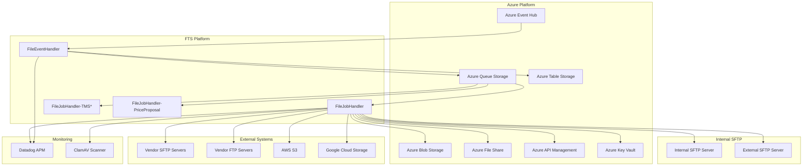
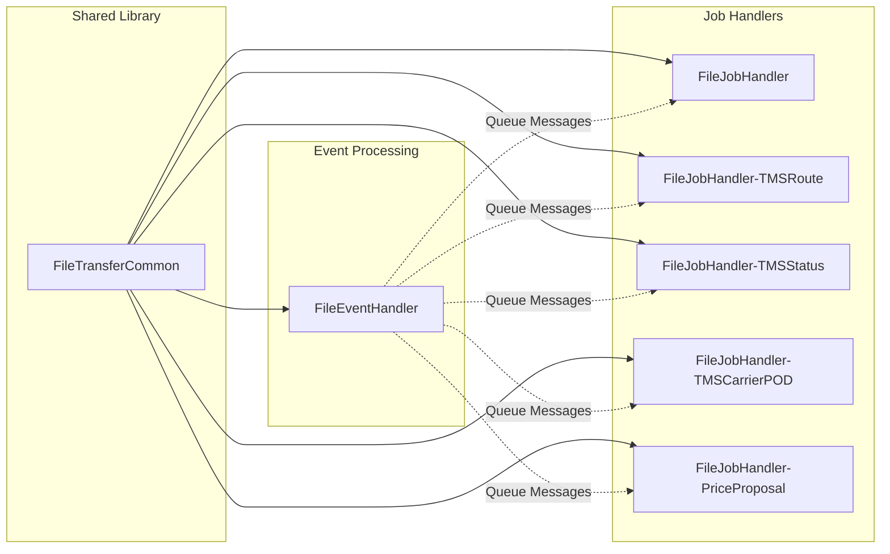

# System Architecture Overview

The File Transfer System (FTS) is an enterprise-grade, event-driven microservices platform for orchestrating file transfers across multiple storage systems and cloud providers.

## System Context

## Component Relationships

## Component Overview

### FileTransferCommon
Shared library providing:
- Common interfaces (`IServersReadWrite`, `IVirusScan`, `IActionProcess`)
- Data models (`Notification`, `Credentials`)
- Azure service helpers (Queue, Table, Blob operations)
- PGP/RSA encryption utilities
- Logging infrastructure

### FileEventHandler
Event ingestion service:
- Listens to Azure Event Hub for CloudEvents notifications
- Validates incoming messages
- Routes messages to appropriate queues based on `jobconfig` table
- Records job status to `jobstatus` table

### FileJobHandler
Generic job processing handler:
- Reads job configurations from mounted file share
- Executes action sequences (read, transform, write)
- Supports all source/destination types
- Handles encryption, virus scanning, encoding

### Specialized Handlers
Domain-specific handlers with custom business logic:
- **TMSRoute**: Transportation Management System routing files
- **TMSStatus**: TMS status file processing
- **TMSCarrierPOD**: Carrier Proof of Delivery processing
- **PriceProposal**: Pricing proposal file handling

## Data Flow

1. **Event Ingestion**: External systems or internal processes publish CloudEvents to Azure Event Hub
2. **Event Routing**: FileEventHandler reads events, validates them, and routes to appropriate queue
3. **Job Pickup**: Job handlers poll their assigned queue for messages
4. **Config Resolution**: Handler loads `jobsettings.json` from mounted file share
5. **Action Execution**: Handler executes configured actions in sequence
6. **Status Reporting**: Handler updates job status and fires completion events

## Storage Architecture

| Storage Type | Purpose | Access Pattern |
|--------------|---------|----------------|
| Azure Event Hub | Event ingestion | Pub/Sub streaming |
| Azure Queue Storage | Job distribution | Queue-based polling |
| Azure Table Storage | Configuration and status | Key-value lookup |
| Azure Blob Storage | File staging and storage | Object storage |
| Azure File Share | Job configurations | Mounted file system |
| Azure Key Vault | Secrets management | Secret retrieval |

## Security Layers

1. **Transport Security**: TLS for all Azure services, SFTP/FTPS for file transfers
2. **Authentication**: SAS tokens, managed identities, SSH keys
3. **Encryption**: PGP encryption/decryption, RSA encryption
4. **Virus Scanning**: ClamAV integration for uploaded files
5. **Secrets Management**: Azure Key Vault for sensitive credentials

## Scalability Model

- **Horizontal Scaling**: Multiple handler pod replicas via Kubernetes
- **Queue Isolation**: Separate queues for different workloads prevent contention
- **Event Partitioning**: Event Hub partitions for parallel processing
- **Retry Mechanisms**: Built-in retry with configurable delays

## Related Documentation

- [Event-Driven Architecture](./event-driven-architecture.md)
- [Queue Architecture](./queue-architecture.md)
- [Multi-Cloud Storage](./multi-cloud-storage.md)
- [Deployment Architecture](./deployment-architecture.md)
